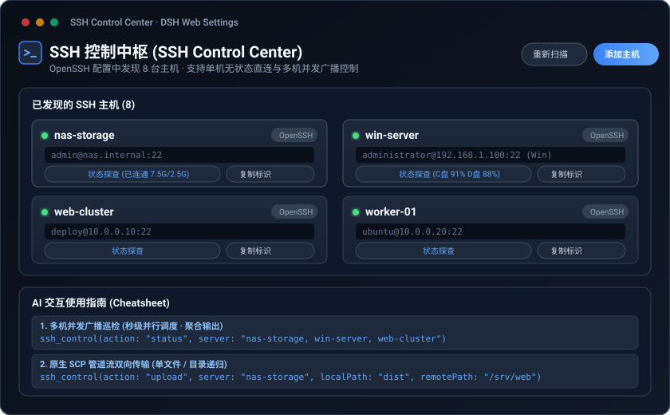
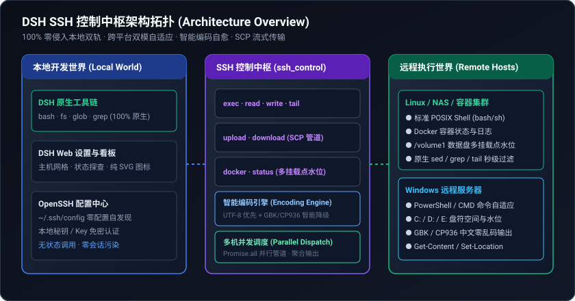

# DSH SSH 控制中枢 (SSH Control Center)

[English](README.md) | 中文


适用于 [DeepSeek Harness](https://github.com/deepseek-ai/deepseek-harness) 的统一 SSH 复合控制中枢插件（`@dsh-external/dsh-ssh-control`）。

本插件为 DSH 提供**零侵入、跨平台兼容、智能编码自愈、支持单机直连与多机并发广播**的远程服务器操作能力，大模型可在同一个本地会话中自由调度多台远程 Linux / NAS / Windows / 容器，而无需对本地开发环境造成任何劫持。

---

## 📸 界面概览



---

## 🌟 核心特性

- **100% 零侵入本地双轨架构**：彻底解绑对 DSH 原生 `bash`、`fs`、`subprocess` 的全局劫持，本地开发工具链保持 100% 原生稳定，远程断线或故障绝不影响本地会话；
- **单一高内聚复合中枢（`ssh_control`）**：将远程执行、文件流转（上传/下载）、容器感知、多盘水位、动态日志、端口隧道收敛为 1 个复合工具，大幅降低 Tool Schema 的 Token 开销（降幅达 85%+）；
- **跨平台双模自适应（Linux POSIX + Windows PowerShell）**：自动感知远端 OS 类型，Linux 自动使用标准 POSIX 语法，Windows 自动适配 PowerShell 命令环境与路径解析；
- **智能多编码容错自愈（UTF-8 + GBK/CP936）**：针对 Windows 中文系统（CP936/GBK）提供原生智能编码探测与无缝转码，彻底杜绝中文乱码；
- **文件流转与目录递归（SCP/SFTP Stream）**：支持单文件与整目录上传（`upload`）与下载（`download`），支持多机并发分发（例如本地构建产物一键分发到多台集群）；
- **多机并发广播调度（Batch Multi-Host）**：原生支持逗号分隔多台主机（如 `server: "nas, deploy-01, 43server"`），底层通过 `Promise.all` 并发管道并行执行并聚合返回结果；
- **容器与服务结构化感知（Docker）**：一键结构化获取远程 Docker 容器状态、镜像、端口映射与健康度，告别杂乱纯文本；
- **动态大日志极速提取（Tail + Grep）**：直接在远端按行截取末尾日志并支持错误关键字（ERROR/FATAL）正则过滤，排障秒级出结果。

---

## 🏛️ 架构拓扑



---

## 🛠️ 核心工具规范 (`ssh_control`)

DSH 对外暴露单一复合中枢工具 `ssh_control`：

| Action | 参数说明 | 描述 |
| :--- | :--- | :--- |
| `exec` | `server`, `command`, `workdir?`, `timeoutMs?` | 在单台或多台远程主机上执行 Shell 命令（跨平台自适应与多机并发） |
| `read` | `server`, `path`, `offset?`, `limit?` | 安全按行读取远程主机上的文本文件 |
| `write` | `server`, `path`, `content` | 通过 Stdin 管道流向远程主机写入文件（零引号转义损耗） |
| `upload` | `server`, `localPath`, `remotePath`, `recursive?` | 将本地文件/目录上传至远程主机（支持批量多机分发） |
| `download` | `server`, `remotePath`, `localPath`, `recursive?` | 从远程主机下载文件/目录至本地 |
| `tail` | `server`, `path`, `lines?`, `pattern?` | 动态获取日志末尾 N 行，并支持错误关键词/正则过滤 |
| `docker` | `server`, `command?` | 结构化探查远程 Docker 容器状态或执行 docker 指令 |
| `status` | `server?` | 探查主机连通性、OS、Uptime、内存与**全部磁盘挂载点水位** |
| `tunnel` | `server`, `port`, `targetPort?`, `tunnelAction` | 建立/停止/查看本地后台 SSH 端口转发隧道 |
| `list` | *无* | 自动解析本地 `~/.ssh/config` 配置，发现所有可用 SSH 主机档案 |
| `attach` / `detach` | `server?`, `path?` | （可选）绑定/解绑当前会话的默认服务器 |

---

## 🚀 快速上手

### 1. 一键安装

```bash
# 方式 A：从 GitHub 远程一键安装（免编译即装即用）
dsh plugin --profile web add github:pipipigu/dsh-ssh-control

# 方式 B：本地开发软链安装
dsh plugin --profile web add link:/home/ppz/project/dsh/dsh-ssh-control

# 启动 Web 界面
dsh web
```

### 2. 交互使用示例

#### 场景 1：单机无状态直连
> **用户**：“帮我查看一下 NAS 上的内存、系统版本和磁盘空间。”
> 
> **大模型**：直接调用 `ssh_control(action: "status", server: "raydrive-nas")`，返回内存与全部挂载点水位（`/`、`/volume1` 等）。

#### 场景 2：多机文件并发分发
> **用户**：“把本地编译好的 dist/ 目录一键上传到 nas 和 deploy-01 的 /srv/web 路径下。”
> 
> **大模型**：调用 `ssh_control(action: "upload", server: "nas, deploy-01", localPath: "dist", remotePath: "/srv/web")`。

#### 场景 3：大日志精准排障
> **用户**：“查看 43 服务器上 app.log 最后的 100 行错误日志。”
> 
> **大模型**：调用 `ssh_control(action: "tail", server: "43server", path: "/var/log/app.log", lines: 100, pattern: "ERROR|FATAL")`。

---

## 🧪 自动化测试与质量保障

项目严格遵循单元测试与热启动自检规范：

```bash
# 执行类型检查与全部单测 (24 套件 / 87 测试)
pnpm run check

# 在 DSH 根目录执行独立端口热启动自检与健康探测
./test-boot.sh
```

---

## 📄 开源许可证

本项目基于 [Apache-2.0 License](LICENSE) 开源。
